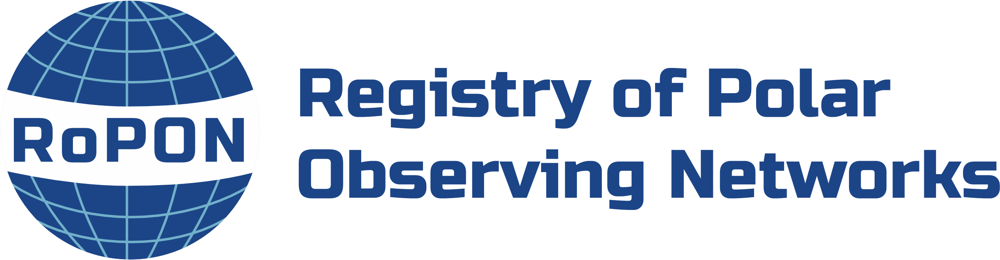
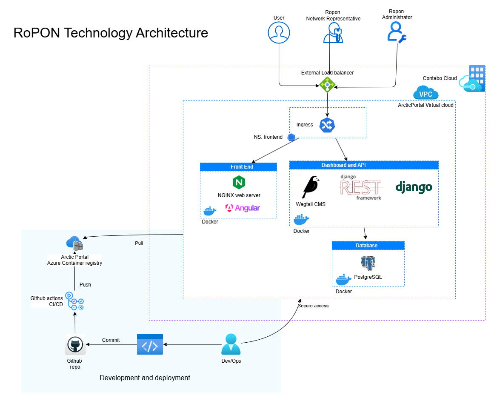

<div align="center">



# RoPON — Registry of Polar Observing Networks

[](https://github.com/arcticportal/ropon/actions/workflows/wagtail-tests.yml)
[](https://github.com/arcticportal/ropon/actions/workflows/combined-services-test.yml)


A platform to discover, browse, and understand polar observing networks and their metadata.

[Overview](#overview) · [Architecture](#architecture) · [Features](#features) · [User roles](#user-roles) · [Observing network model](#observing-network-model) · [Tech stack](#tech-stack) · [Getting started](#getting-started) · [Project structure](#project-structure) · [Resources](#resources)

</div>

## Overview

The **Registry of Polar Observing Networks (RoPON)** is a central, openly accessible
registry for metadata about polar and cryospheric observing networks. It brings together
scattered information about who is observing what, where, and how — making it easier for
researchers, funders, and the public to discover and understand the global landscape of
polar observation.

RoPON serves two audiences:

- **Network representatives & administrators** manage network metadata through a rich
  content-management dashboard.
- **Researchers & the public** explore networks through an interactive, map-driven
  frontend.

The platform is built as a **decoupled (headless) system**: a Wagtail/Django backend
provides the editorial dashboard and a REST API, while an Angular single-page application
consumes that API to render the public website.

## Architecture

<div align="center">
  
</div>

RoPON is deployed as a set of containerized services behind an external load balancer.

| Component | Role |
|-----------|------|
| **Frontend** | Angular SPA served by NGINX. The public-facing website that lets users discover and browse observing networks. |
| **Dashboard & API** | Wagtail CMS running headless, exposing an editorial admin dashboard **and** a versioned REST API (via Django REST Framework). |
| **Database** | PostgreSQL for relational data storage (networks, vocabularies, users). |
| **Cache** | Redis for response caching and session performance (optional — falls back to local memory when unset). |
| **Media files** | A dedicated NGINX container serves user-uploaded documents and images managed through Wagtail. |

**Deployment flow:** Developers push to GitHub → GitHub Actions builds Docker images →
images are pushed to the Arctic Portal Azure Container Registry → the hosting environment
(Contabo Cloud) pulls the latest images and redeploys. Production releases are triggered by
GitHub releases.

## Features

- **Headless CMS** — Network representatives curate structured metadata through the Wagtail
  dashboard; content is published exclusively through the API.
- **Interactive map** — An OpenLayers-based frontend lets users explore observing networks
  geographically.
- **Versioned REST API** — A documented API (OpenAPI/Swagger via drf-spectacular) for
  programmatic access to network data.
- **Spatial coverage** — Networks record their geographic extent as bounding boxes for
  map-based discovery.
- **Role-based access** — Two roles control who can do what (see [User roles](#user-roles)).
- **Containerized** — Every service runs in Docker, with per-environment Compose files and
  configuration.

## User roles

Access to the Wagtail dashboard is built around two roles:

- **RoPON Admin** — Full control: manages all observing networks across the registry,
  moderates and publishes submissions, and manages user accounts.
- **Network Representative (NR)** — A scoped editor. When an NR is granted access, they are
  assigned their **own** observing network. They can edit only that network's metadata and
  submit changes for moderation; they cannot create new networks or manage other users.

## Observing network model

The core of the registry is the **`ObservingNetworkPage`** model, a Wagtail page type that
represents a single observing network. Each network entry captures structured metadata such
as its name, abbreviation, description, website, contact, organizations involved, temporal
coverage (start year), spatial extent as one or more bounding boxes, data repositories, and
asset-level catalog information.

To keep data consistent and queryable across networks, several fields draw from a shared
**controlled vocabulary** rather than free text. Curated values include:

- **Domains** — broad scope of observation (atmosphere, land, ocean)
- **Disciplines** — scientific or thematic focus
- **Regions & Subregions** — geographic coverage (e.g. Arctic, Antarctica, Southern Ocean)
- **Asset types** — categories of observing infrastructure or activity
- **Metadata standards & Access protocols** — standards used for asset-level data access

Administrators maintain these vocabularies centrally so that networks describe themselves
using a common language, enabling consistent filtering and discovery on the public frontend.

> [!NOTE]
> For the complete network metadata model and field-level details, see the
> [RoPON resources](https://www.polarobservingassets.org/resources). For answers to common
> questions about the registry, visit the [RoPON FAQ](https://polarobservingregistry.org/ropon-pages/faq).

## Tech stack

| | |
|---|---|
| **Backend** | Python 3.12 · Django 5.1 · Wagtail 6.2 · Django REST Framework · drf-spectacular |
| **Frontend** | Angular 18 · TypeScript · OpenLayers · RxJS |
| **Data** | PostgreSQL · Redis |
| **Serving** | Gunicorn (WSGI) · NGINX (reverse proxy & static/media) · WhiteNoise |
| **Infra** | Docker / Docker Compose · GitHub Actions CI/CD · Azure Container Registry |

## Getting started

> [!NOTE]
> The project ships with environment-specific Docker Compose files under `deploy/`.
> Prefer those over the legacy files in `docker/`.

### Prerequisites

- [Docker](https://docs.docker.com/get-docker/) and Docker Compose
- [Git](https://git-scm.com/)
- (Optional, for frontend-only work) [Node.js 18+](https://nodejs.org/) and npm

### Run the full stack (frontend + backend)

This brings up the frontend, backend, database, and cache together, then runs the
bootstrap to apply migrations and seed an admin user:

```bash
# Build and start all services
docker compose -f deploy/docker-compose-test.yml up --build

# In a second terminal, initialise the backend
docker compose -f deploy/docker-compose-test.yml run backend python manage.py init_setup
```

Once running, the services are available at:

| Service | URL |
|---------|-----|
| Frontend | http://localhost:4200 |
| Wagtail admin dashboard | http://localhost:8000/admin/ |
| API | http://localhost:8000/api/v2/ |

### Run the backend only

```bash
docker compose -f deploy/backend/docker-compose-test.yml build
docker compose -f deploy/backend/docker-compose-test.yml run wagtail python manage.py init_setup
docker compose -f deploy/backend/docker-compose-test.yml up
```

### Frontend development

For iterative frontend work against a running backend:

```bash
cd angular
npm install
npm start        # ng serve --host 0.0.0.0 (default "local" config)
```

### Configuration

All runtime configuration is environment-driven (loaded via `environs`, which auto-reads
`.env` files). Key variables include database credentials, `DJANGO_SECRET_KEY`,
`DJANGO_ALLOWED_HOSTS`, `CSRF_TRUSTED_ORIGINS`, `CORS_ALLOWED_ORIGINS`, and `REDIS_HOST`.
See the example env files under `deploy/backend/` and `deploy/frontend/` for the full list.


## Project structure

```
ropon/
├── backend/              # Django + Wagtail application
│   ├── ropon/            # Project settings (base/dev/prd) & URL config
│   ├── ropon_auth/       # Custom user model & roles
│   ├── ropon_data/       # Observing network models, API, and business logic
│   ├── ropon_pages/      # Static page types
│   ├── ropon_email/      # Contact form / email handling
│   ├── base/             # Shared models & API base
│   └── manage.py         # Defaults to ropon.settings.dev
├── angular/              # Angular 18 SPA (public frontend)
├── deploy/               # Docker Compose files, Dockerfiles, per-env configs
│   ├── backend/          # Backend Dockerfile + requirements + test compose
│   └── frontend/         # Frontend Dockerfile + NGINX config + env files
└── docs/                 # Architecture diagrams & assets
```

## Testing

Backend tests use Django's built-in test runner (`unittest`) and live in `<app>/tests/`
packages. The CI pipeline runs them inside Docker:

```bash
docker compose -f deploy/backend/docker-compose-test.yml build
docker compose -f deploy/backend/docker-compose-test.yml run wagtail python manage.py init_setup
docker compose -f deploy/backend/docker-compose-test.yml run wagtail python manage.py test
```


## Resources

- [RoPON FAQ](https://polarobservingregistry.org/ropon-pages/faq)
- [RoPON network model & resources](https://www.polarobservingassets.org/resources)
- [Wagtail CMS documentation](https://docs.wagtail.org/)
- [Django REST Framework](https://www.django-rest-framework.org/)
- [Angular documentation](https://angular.dev)

<div align="center">

Built and maintained by the [Arctic Portal](https://arcticportal.org) team.

</div>
